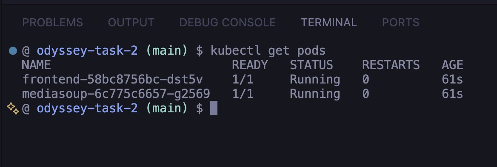

# GLB Avatar World

React + Three.js app with a walking fox avatar, WASD controls, and a 2D mini-map. Full stack runs locally via Docker Compose and Kubernetes.

## Stack

| Layer | Tech |
|---|---|
| Frontend | React 18, TypeScript, Three.js, @react-three/fiber |
| Server | Node.js 20, Express, mediasoup |
| Container | Docker Compose, nginx |
| Orchestration | Kubernetes (kind) |

## Run with Docker Compose

```bash
cp .env.example .env
docker compose up --build
```

- Fox avatar: http://localhost:3000
- Health check: http://localhost:3000/health

## Run with Kubernetes (kind)

```bash
# Build images
docker build -t odyssey-task-2-frontend:latest ./frontend
docker build -t odyssey-task-2-mediasoup:latest ./server

# Load into kind cluster
kind load docker-image odyssey-task-2-frontend:latest --name odyssey
kind load docker-image odyssey-task-2-mediasoup:latest --name odyssey

# Deploy
kubectl apply -f k8s/
kubectl get pods
```

- Fox avatar: http://localhost:8080
- Mediasoup: http://localhost:3001/health

## Pods Running




## UDP Port Handling

**Docker Compose** — the mediasoup RTC port range is mapped directly in `docker-compose.yml`:

```yaml
ports:
  - "40000-40100:40000-40100/udp"
```

Docker supports port ranges natively, so all 100 UDP ports are exposed in one line.

**Kubernetes** — Services do not support port ranges. The mediasoup pod uses `hostNetwork: true`, which shares the node's network directly so the worker binds UDP ports 40000–40100 straight to the host — no Service mapping needed.

## Project Structure

```
frontend/   React app + Three.js scene
server/     mediasoup signalling server
k8s/        Kubernetes manifests
doc/        UDP port strategy note
```
